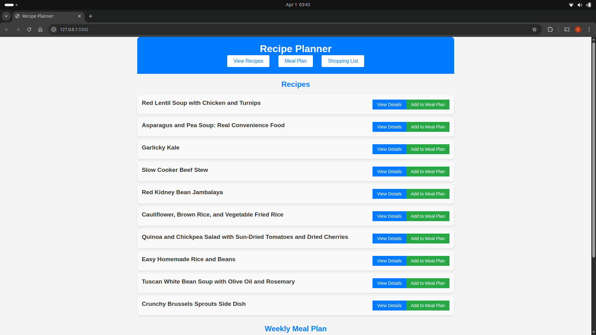
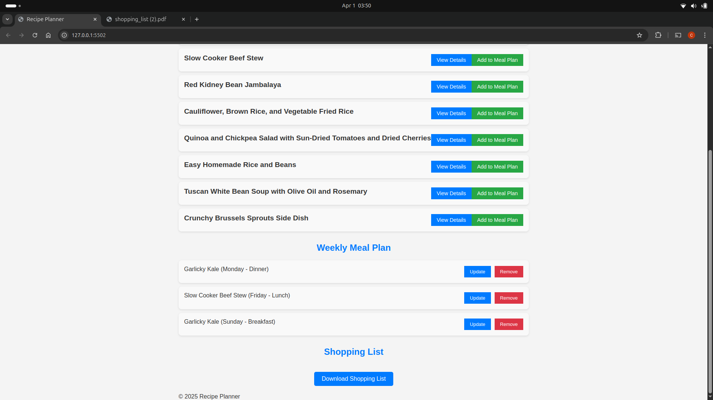
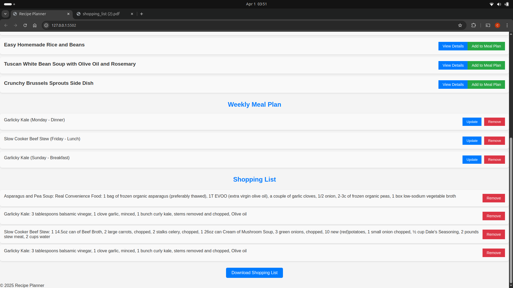
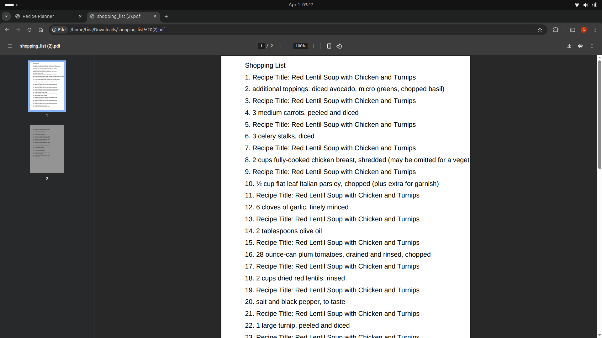

# Meal-Prep-APP

## Overview
The **Meal-Prep-APP** is a modern web-based application that helps users plan their meals for the week. This app allows users to search for recipes, view detailed recipe instructions, add meals to their weekly meal plan, generate shopping lists, and export their meal plans. Built with HTML, CSS, and JavaScript, it integrates with the Spoonacular API for fetching recipe data.

With its intuitive interface, the app is perfect for anyone looking to simplify their meal prep and grocery shopping process.

## Key Features
- **Recipe Details**: View detailed information about each recipe, including ingredients and cooking instructions.
- **Add Recipes to Meal Plan**: Easily add recipes to specific days in your weekly meal plan.
- **Shopping List Generation**: Automatically generate a shopping list based on the selected recipes.
- **Meal Plan Export**: Download your meal plan and shopping list as a PDF file.
- **Responsive Design**: The app is fully responsive, ensuring a smooth experience on both mobile and desktop devices.
- **Customizable Meal Swaps**: Swap meals between days to suit your schedule.

## Screenshots

### Recipes
**

### Meal Plans
**

### SHopping Lists 
**

### Douwloaded List 
**

## Installation
To run the **Meal-Prep-APP** locally, follow the steps below:

### Prerequisites
- A modern web browser (Chrome, Firefox, etc.)
- An internet connection to fetch recipe data from the Spoonacular API.

### Steps
1. **Clone the Repository**:
   ```bash
   git clone https://github.com/yourusername/meal-prep-app.git

2. **Navigate to the Project Folder**:

    ```bash
    cd meal-prep-app

3. **Open the Project in Your Browser**:

    - Open the index.html file directly in your web browser by double-clicking it or right-clicking to open with a browser.

4. **Start using the app**:

    - Once opened, you can start using the Meal Prep app by searching for recipes, adding them to your meal plan, and generating shopping lists.


### Setup API Key
- To fetch recipes from the Spoonacular API, you’ll need an API key.

### Steps to Get an API Key
- Visit Spoonacular's API site.

 - Create an account and get your API key from the dashboard.

- Replace the placeholder API key in your code:

- Open app.js and find the line where the API key is defined:

    ```bash
        const API_KEY = 'your-api-key-here';

- Replace 'your-api-key-here' with your actual API key.

### Usage

1. Add Recipe to Meal Plan
    - Click on the "Add to Meal Plan" button next to any recipe.

    - A prompt will appear asking you to select a day of the week and a meal time (e.g., Monday Dinner, Tuesday Lunch).

2. View Weekly Meal Plan
    - Navigate to the Meal Plan section to view all added recipes for the week.

    - You can remove any recipe or swap meals between days for flexibility.

3. Generate Shopping List
    - Once meals are added to your plan, the app will automatically generate a shopping list with all the ingredients needed.

    - You can download this list in JSON format by clicking the "Download Shopping List" button.

4. Export Meal Plan
    - Export the entire meal plan and shopping list by clicking the "Download Meal Plan" button.

### Technologies Used
 - HTML: Provides the structure of the web pages.

 - CSS: Used for styling the app, ensuring it’s responsive and visually appealing.

 - JavaScript: Handles all the functionality of the app, including API requests, meal plan management, and shopping list generation.

 - Spoonacular API: Fetches recipes, ingredients, and cooking instructions.

 - GitHub Pages (optional): For deploying your app.

## API Integration
 - This app uses the Spoonacular API to retrieve recipes and their details.

### Setting up Spoonacular API Key
1. Create an account on Spoonacular.

2. Get your API key from the Spoonacular API Dashboard.

3. Update the API_KEY variable in your app.js file:

    ```bash
    const API_KEY = 'your-api-key-here';

## Troubleshooting
### Common Issues
1. 404 Errors: Ensure that the API URL is correct and the API key is valid.

2. CORS Issues: CORS issues can occur if the server doesn’t allow cross-origin requests. During development, you can use a CORS proxy like CORS Anywhere.

   - Alternatively, configure your backend to handle CORS requests if you're running a custom backend server.

3. API Limit Reached: Spoonacular API has rate limits, so if you exceed them, the API will stop responding. Consider upgrading your plan if needed.

## Contributing
- We welcome contributions to this project! To contribute:

1. Fork the repository.

2. Create a new branch for your feature or bug fix.

3. Make your changes and commit them with clear commit messages.

4. Push your changes to your forked repository.

5. Create a pull request to merge your changes into the main repository.

## License
- This project is licensed under the MIT License – see the LICENSE file for details.

## Acknowledgements
- Spoonacular API for providing access to an extensive database of recipes.

- Font Awesome for the helpful icons.

- Unsplash for free high-quality images used in the app.

## Contact
- If you have any questions or feedback, feel free to contact me:

- Email: [christinamanga98@gmail.com]


## N/B
- The API is currently using json server as an API simulation because Spoonacular API is limited to 150 API call counts per day which limit the development process hence the need to store the data fetched in a json file to facilitate my development process. I will be glad to guide if in need of any clarification or assistance to implement such an application.


  -This is the website URL: https://mealprepapp.netlify.app/-

  ## How to run the App.
  - Run npm Installation on the terminal
  - then run  json-server --watch db.json command on your terminal making sure you have installed  npm install json-server.
- It works when the json server is running.